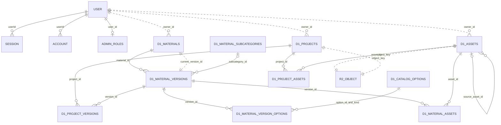

# Google 로그인·관리자 자재 관리·D1/R2 설계

이 문서는 SJN의 Google 로그인, 관리자 자재 라이브러리, 프로젝트 소유권과 저장 구조를 설명한다. 실행용 SQL의 원본은 `migrations/d1/0001_auth.sql`부터 `0004_catalog_seed.sql`까지다. 기존 `0001`·`0002` 적용 이력은 수정하지 않고 `0003`·`0004`로 확장한다.

**코드·SQL 파일을 작성하는 것과 운영 DB에 적용하는 것은 별도 단계다.** 현재 원격 D1 `sjn`에는 `0001`~`0004`가 적용됐으며 상세 확인값은 8절을 따른다. 앱의 운영 연결·Google OAuth·R2 검증과 관리자 지정·배포는 별도이며 이번 작업에서 수행하지 않았다. Google 비밀키, Better Auth secret, 로그인 토큰은 이 문서나 소스에 넣지 않는다.

## 1. 이용 화면과 권한

| 기능                                               | 비로그인    | 일반 회원               | 관리자                                    |
| -------------------------------------------------- | ----------- | ----------------------- | ----------------------------------------- |
| `/materials` 공개 자재 목록·상세·검색              | 가능        | 가능                    | 가능                                      |
| 활성 공용 자재의 표시 이미지                       | 가능        | 가능                    | 가능                                      |
| 프로젝트 생성·편집·복제·삭제·내보내기              | 로그인 필요 | 본인 것만               | 본인 것만                                 |
| 다른 회원의 프로젝트·개인 이미지 조회              | 불가        | 불가                    | 불가                                      |
| `/admin/materials` 자재 등록·수정·비활성화         | 불가        | 불가                    | 가능                                      |
| `/admin/catalog` 분류·속성 등록·수정·비활성화      | 불가        | 불가                    | 가능                                      |
| 사진 분석·사진 추출로 만든 프로젝트 전용 모형 저장 | 불가        | 제한된 본인용 생성 경로 | 제한된 본인용 생성 경로                   |
| 회원 권한 변경                                     | 불가        | 불가                    | 앱 화면/API로는 불가; 운영자가 SQL로 지정 |

관리자는 다른 회원의 프로젝트를 열 수 있는 전체 데이터 관리자가 아니다. 공용 자재·기준 데이터 관리 권한만 추가된다. 로컬 개발 모드에서는 기존 IndexedDB 개발 기능을 유지하지만, 이것이 운영 API의 관리자 인증을 대신하지 않는다.

로그인 화면 `/login`은 **Google로 시작하기** 버튼 하나를 사용한다. 첫 로그인에서 일반 회원 계정이 만들어지고, 같은 Google 계정으로 다시 접속하면 기존 계정으로 로그인한다. 비밀번호 가입, 최초 가입자 자동 관리자 지정, 사용자의 자기 권한 변경 경로는 없다. Google callback은 `/api/auth/callback/google`이다.

## 2. 저장소와 공개 범위

| 위치                     | 저장 내용                                                                                  | 접근 방식                                                |
| ------------------------ | ------------------------------------------------------------------------------------------ | -------------------------------------------------------- |
| D1 `DB`                  | 회원·세션·역할, 프로젝트 목록·revision, 자재 버전 JSON, 기준 데이터·참조, 재시도·정리 기록 | 서버 바인딩과 검증된 API                                 |
| 비공개 R2 `ASSET_BUCKET` | 이미지·원본·가공 자료·메시, 프로젝트 JSON 스냅샷                                           | 서버 바인딩; 공개 버킷이나 S3 키 배포 불필요             |
| 정적 파일 `ASSETS`       | 앱의 JS·CSS·정적 파일                                                                      | Workers 정적 파일 바인딩; 사용자 이미지 버킷과 다름      |
| 로컬 IndexedDB           | 기존 로컬 프로젝트·자재·사진                                                               | 해당 브라우저/도메인만; 로그인해도 자동 업로드하지 않음  |
| 브라우저 복구 저장소     | 서버 미저장 작업과 자산 캐시                                                               | 계정·저장 모드별 구분; 계정 변경 시 자동 업로드하지 않음 |

공개 목록은 `scope='shared' AND active=1 AND purpose='catalog'`인 자재의 **현재 버전**만 반환한다. 공개 DTO에는 표시 이름·규격·속성·가격·공개 이미지 API URL만 포함하고, 회원 정보·소유자 ID·프로젝트 JSON·R2 내부 키·전체 원본 payload는 넣지 않는다.

`GET /api/catalog/images?id=...`는 현재 공개 버전에서 직접 사용하는 표시 이미지인지 서버에서 다시 확인한다. 개인 프로젝트 사진, 분석 원본, 제품 메시, `source_asset_id`를 따라간 원본은 공개하지 않는다. 버킷을 공개로 바꾸지 않는다. 자재 비활성화나 버전 교체 후 이전 이미지 URL도 공개 조건을 다시 통과해야 한다.

일반 회원의 프로젝트 분석 모형은 `scope='personal'`, `purpose='project'`로 생성한다. 기존 버전에 `reconstruction` 정보가 있는 자재도 0003에서 `purpose='project'`로 구분하여 공개 카탈로그에서 제외한다. `/api/d1/project-materials`의 제한된 생성 경로만 사용하며, 일반 자재 등록이나 공개 전환 API로 우회할 수 없다. 기존 개인 자재·프로젝트·불변 버전은 보존하고 일괄 공개하지 않는다.

## 3. ERD

실선 관계는 외래 키가 있는 연결이다. 점선 관계는 기존 스키마의 소유권/현재 버전처럼 서버가 검증하는 논리 관계다. `R2_OBJECT`는 D1 테이블이 아닌 비공개 R2 객체다.



`owner_id` 및 `current_version_id`에 새 외래 키를 추가하려고 기존 테이블을 재생성하지 않는다. 기존 호환성을 유지하고 서버의 인증·소유권·D1 batch 조건 검증으로 보호한다. 새 기준 데이터 연결은 외래 키·유일 제약·카테고리 확인 트리거로 DB에서도 제한한다. D1에는 이 앱의 사용자별 RLS가 없으므로 D1/R2 관리 토큰을 브라우저에 전달해서는 안 된다.

## 4. 테이블·컬럼 설명

ID는 앱에서 UUID를 사용한다. 기존 SQL의 ID 컬럼은 `TEXT`이고 UUID 형식은 서버 입력 검증으로 제한한다. Boolean은 `INTEGER`의 0/1이다. 날짜는 기존 스키마의 `TEXT`를 유지하며 앱이 쓰는 ISO 시각과 SQL 기본값 `CURRENT_TIMESTAMP`를 용도별로 사용한다. 각 컬럼의 정확한 NULL·DEFAULT·CHECK·인덱스 정의는 아래 전체 DDL을 기준으로 한다.

### 인증 테이블 — 기존 Better Auth 구조 유지

| 테이블         | 컬럼                                                                                                                                                                                | 의미                                                                                                                                    |
| -------------- | ----------------------------------------------------------------------------------------------------------------------------------------------------------------------------------- | --------------------------------------------------------------------------------------------------------------------------------------- |
| `user`         | `id`, `name`, `email`, `emailVerified`, `image`, `createdAt`, `updatedAt`                                                                                                           | 회원 ID, 표시 이름, 고유 이메일, 이메일 검증 여부, 프로필 이미지, 가입/변경 시각                                                        |
| `session`      | `id`, `expiresAt`, `token`, `createdAt`, `updatedAt`, `ipAddress`, `userAgent`, `userId`                                                                                            | 세션 식별자·만료·고유 토큰·시각·접속 정보·회원 FK. 회원 삭제 시 cascade                                                                 |
| `account`      | `id`, `accountId`, `providerId`, `userId`, `accessToken`, `refreshToken`, `idToken`, `accessTokenExpiresAt`, `refreshTokenExpiresAt`, `scope`, `password`, `createdAt`, `updatedAt` | Google 계정 연결과 OAuth 토큰·만료·scope. `providerId,accountId` 고유. `password`는 라이브러리 호환 컬럼이며 비밀번호 로그인은 비활성화 |
| `verification` | `id`, `identifier`, `value`, `expiresAt`, `createdAt`, `updatedAt`                                                                                                                  | OAuth state 등 인증 검증 자료. 공개 API 반환 금지                                                                                       |
| `rateLimit`    | `id`, `key`, `count`, `lastRequest`                                                                                                                                                 | Better Auth 요청 속도 제한. 마지막 요청은 정수 시각                                                                                     |
| `admin_roles`  | `user_id`, `created_at`                                                                                                                                                             | 해당 회원에게 관리자 역할 부여. `user_id`가 PK이자 회원 FK                                                                              |
| `d1_auth_meta` | `id`, `version`                                                                                                                                                                     | 인증 스키마 준비 확인. 한 행 `(1,1)`                                                                                                    |

OAuth 토큰 암호화·HttpOnly 세션 쿠키·출처 검사·CSRF 검사를 사용한다. 관리자 여부는 서버가 `admin_roles`에서 확인하며 요청 본문이나 브라우저 저장소의 역할 값은 신뢰하지 않는다.

### 프로젝트·자재·파일

| 테이블                 | 컬럼                                                                                                                       | 의미                                                                                                                                                                                        |
| ---------------------- | -------------------------------------------------------------------------------------------------------------------------- | ------------------------------------------------------------------------------------------------------------------------------------------------------------------------------------------- |
| `d1_projects`          | `id`, `owner_id`, `name`, `storage_revision`, `object_key`, `byte_size`, `summary_json`, `created_at`, `updated_at`        | 본인 프로젝트 목록, 1 이상 revision, 비공개 R2 문서 키·크기, 목록 요약 JSON, 시각. revision으로 동시 수정 충돌 확인                                                                         |
| `d1_assets`            | `id`, `owner_id`, `object_key`, `source_asset_id`, `metadata_json`, `content_hash`, `created_at`, `deleting`               | 파일 메타데이터, R2 키, 파생 이미지의 원본 FK, 내용 해시, 정리 중 표시. metadata에는 MIME·종류·규격 등 저장                                                                                 |
| `d1_materials`         | `id`, `owner_id`, `scope`, `current_version_id`, `active`, `created_at`, `updated_at`, **`purpose`**                       | 자재 논리 ID와 현재 버전. scope는 personal/shared, purpose는 catalog/project. 신규 관리자 자재는 shared/catalog, 분석 모형은 personal/project                                               |
| `d1_material_versions` | `id`, `material_id`, `version`, `object_key`, `payload_json`, `category`, `view_count`, `created_at`, **`subcategory_id`** | 불변 자재 버전. 자재별 버전 번호 고유. 현재 구현은 최대 512KiB payload JSON을 D1에 기록하며 nullable object_key는 기존 호환용. category는 렌더링 코드, subcategory_id는 선택적 하위 분류 FK |
| `d1_project_assets`    | `project_id`, `asset_id`                                                                                                   | 프로젝트에서 직접 쓰는 자산의 복합 PK/FK 연결                                                                                                                                               |
| `d1_project_versions`  | `project_id`, `version_id`                                                                                                 | 프로젝트가 참조하는 불변 자재 버전. 현재 자재 버전이 바뀌어도 기존 프로젝트 기준 유지                                                                                                       |
| `d1_material_assets`   | `version_id`, `asset_id`                                                                                                   | 자재 버전에 사용된 자산. 참조 중인 파일의 정리 방지                                                                                                                                         |

### 기준 데이터와 자재 버전 연결 — 신규

| 테이블                        | 컬럼                                                                                                 | 의미                                                                                                             |
| ----------------------------- | ---------------------------------------------------------------------------------------------------- | ---------------------------------------------------------------------------------------------------------------- |
| `d1_catalog_options`          | `id`                                                                                                 | 속성 선택지 UUID PK                                                                                              |
|                               | `kind`                                                                                               | `color` 색상, `brand` 브랜드, `composition` 재질, `finish` 마감                                                  |
|                               | `name`                                                                                               | 화면 표시 이름, 1~100자                                                                                          |
|                               | `normalized_name`                                                                                    | NFKC 정규화, 앞뒤 공백 제거, 연속 공백 통합, 소문자 변환한 중복 검사용 이름                                      |
|                               | `color_hex`                                                                                          | 색상에만 허용하는 선택적 `#RRGGBB`. 서버와 DB CHECK가 16진수 문자를 검증                                         |
|                               | `sort_order`, `active`                                                                               | 표시 순서와 새 등록에서 선택 가능 여부                                                                           |
|                               | `created_at`, `updated_at`                                                                           | 생성·변경 시각                                                                                                   |
| `d1_material_subcategories`   | `id`, `category_code`, `name`, `normalized_name`, `sort_order`, `active`, `created_at`, `updated_at` | 기존 상위 제품 코드 아래 한 단계 하위 분류. 카테고리 내 정규화 이름 고유. 속성과 같은 정렬·활성 규칙             |
| `d1_material_version_options` | `version_id`, `option_id`, `option_kind`                                                             | 자재 버전의 속성 선택. `(version_id,option_id)` PK. `(option_id,option_kind)` 복합 FK로 다른 종류의 ID 사용 방지 |
| `d1_catalog_meta`             | `id`, `version`                                                                                      | 카탈로그 스키마 버전 한 행 `(1,1)`                                                                               |

브랜드는 `option_kind='brand'`에 대한 부분 유일 인덱스로 **버전당 최대 하나**를 DB에서도 보장한다. 색상·재질·마감은 여러 행을 연결할 수 있다. 하위 분류는 버전의 단일 FK이며, insert/update 트리거가 상위 렌더링 카테고리 일치 여부를 검사한다. 기준 데이터 종류/상위 카테고리는 생성 후 이동할 수 없다. 삭제 API 대신 `active=0`으로 비활성화한다.

속성 ID와 별도로 서버가 조회한 표시 이름을 자재 버전 `payload_json`의 `brand`, `color`, `composition`, `finish`, `subcategoryName`에 스냅샷으로 저장한다. 기준 데이터 이름을 바꾸거나 비활성화해도 이미 저장된 프로젝트의 표시 이름과 자재 버전은 바뀌지 않는다. 새 버전을 저장할 때는 다시 활성 상태를 검사한다.

### 저장 안정성·유지관리

| 테이블            | 컬럼                                                                                                             | 의미                                                                                             |
| ----------------- | ---------------------------------------------------------------------------------------------------------------- | ------------------------------------------------------------------------------------------------ |
| `d1_storage_meta` | `version`                                                                                                        | 저장소 스키마 준비 확인. 단일 version=1                                                          |
| `d1_cleanup_jobs` | `object_key`, `owner_id`, `asset_id`, `eligible_at`, `attempts`, `lease_token`, `lease_until`, `next_attempt_at` | 미참조 R2 객체 정리 작업, 유예 시각, 시도 수, 동시 작업 임대, 재시도 시각                        |
| `d1_mutations`    | `owner_id`, `request_key`, `resource`, `request_hash`, `response_key`, `response_json`, `created_at`             | 재시도 중복 저장 방지. 소유자+요청 키 PK, 요청 내용 해시, R2 응답 키 또는 직접 JSON 중 최소 하나 |
| `d1_checks`       | `id`, `conflict_ok`, `reference_ok`                                                                              | D1 batch 내부 조건 검증용 CHECK. 실패 시 전체 batch 중단, 성공 시 검증 행 삭제                   |
| `d1_maintenance`  | `owner_id`, `next_run_at`                                                                                        | 소유자별 다음 유지관리 가능 시각                                                                 |

D1 transaction과 R2 업로드는 하나의 분산 transaction이 아니다. R2 저장을 완료한 뒤 D1 참조를 확정한다. 업로드 실패 시 자재/프로젝트 등록 성공으로 표시하지 않으며, D1 실패로 남은 R2 객체는 기존 정리 흐름을 사용한다. 참조되는 자산과 자재 버전은 유지한다.

## 5. 선택 입력 계약과 과거 자료

서버에는 검색 문자열 대신 아래처럼 **선택된 ID**를 보낸다. ID 예시는 SQL 기본 데이터와 같은 UUID이며, 입력하지 않은 선택은 빈 배열 또는 생략한다.

```json
{
  "catalog": {
    "brandId": "5560a412-a3a6-524f-b31c-db89d5499fba",
    "subcategoryId": "da9e1bde-22a2-5341-be21-2ee2ef79ba54",
    "colorIds": ["63669fdb-c614-57cb-b6fb-2b069166ac67"],
    "compositionIds": ["5bd253c7-50f3-5dc9-9ff6-fd19c7ad3969"],
    "finishIds": ["f18a9b16-b5f6-5ada-a921-a451b74dfea7"]
  }
}
```

위 예는 `toilet` 카테고리에서 TOTO·원피스·그레이·도기·무광을 선택한 부분 계약이다. 실제 자재 저장에는 이름·규격·이미지 등 기존 MaterialInput 필드도 필요하다. 서버는 ID 존재 여부, 종류, 활성 상태, 브랜드 단일 선택, 하위 분류의 상위 종류를 검사하고 표시 이름을 직접 채운다. 임의 이름을 보내도 기준 데이터가 자동 생성되지 않는다.

자재 입력창은 목록을 스크롤하거나 `그레`처럼 부분 검색해 선택한다. 영문 대소문자를 구분하지 않는다. 색상·재질·마감은 태그로 표시하고 개별 제거할 수 있다. 검색어와 선택 값은 별도로 보관하며 한글 조합 중 Enter는 선택으로 처리하지 않는다. 새 선택지를 만드는 곳은 `/admin/catalog`뿐이다.

`0004`의 기존 자료 연결은 `brand`, `color`, `finish`의 **공백을 제거하고 영문 소문자로 바꾼 전체 문자열이 정확히 일치할 때만** 수행한다. 쉼표 등으로 과거 값을 임의 분해하지 않고, 알 수 없는 과거 문자열을 새 선택지로 만들지 않는다. 과거 payload는 수정하지 않는다. 일치하지 않은 값은 과거 버전의 기록으로 남고, 관리자가 새 버전을 저장할 때 등록된 활성 값을 선택하거나 비워야 한다.

## 6. 기본 데이터

| 구분                  | 기본 항목                                                                                                                                                              |
| --------------------- | ---------------------------------------------------------------------------------------------------------------------------------------------------------------------- |
| 색상 9개              | 화이트, 아이보리, 베이지, 그레이, 차콜, 블랙, 브라운, 블루, 그린                                                                                                       |
| 브랜드 7개            | 대림바스, 로얄앤컴퍼니, 아메리칸스탠다드, TOTO, KOHLER, GROHE, hansgrohe                                                                                               |
| 재질 10개             | 포세린, 세라믹, 도기, 유리, 스테인리스, 황동, 알루미늄, 천연석, 인조대리석, 목재                                                                                       |
| 마감 7개              | 무광, 유광, 반광, 폴리싱, 브러시드, 엠보, 크롬                                                                                                                         |
| 타일 하위 분류        | 포세린 타일, 세라믹 타일, 모자이크 타일                                                                                                                                |
| 변기 하위 분류        | 원피스, 투피스, 벽걸이                                                                                                                                                 |
| 세면대 하위 분류      | 탑볼, 언더카운터, 벽걸이                                                                                                                                               |
| 나머지 기본 하위 분류 | 세면대장: 일체형·하부장형 / 욕조: 매립형·독립형 / 샤워기: 해바라기 샤워·핸드 샤워 / 수전: 세면 수전·주방 수전 / 거울: 일반 거울·조명 거울 / 유리 파티션: 고정형·도어형 |

속성 33개, 하위 분류 21개다. 상위 코드는 `tile`, `toilet`, `basin`, `vanity`, `bath`, `shower`, `faucet`, `mirror`, `door`, `window`, `glassPartition`, `mirrorCabinet`, `wallShelf`, `wallCabinet`, `lowPartition`, `showerCurtain`을 유지한다. 관리자 UI는 상위 렌더링 코드를 새로 만들지 않는다.

Seed는 고정 ID와 `ON CONFLICT DO NOTHING`을 사용한다. 동일 seed를 다시 실행해도 기존 관리자 변경 내용을 덮어쓰지 않는다. 단, **마이그레이션 `0003` 전체는 재실행용 SQL이 아니므로** Wrangler 이력 관리 없이 반복 적용하지 않는다.

## 7. 최초 관리자 지정 SQL

1. 관리자 본인이 서비스에서 Google 로그인을 완료한다.
2. 운영자가 올바른 D1을 선택하고 회원 ID·이메일·Google 연결을 확인한다.
3. 아래의 예시 이메일과 사용자 ID를 확인된 값으로 바꾸어 실행한다. Google secret이나 토큰은 필요 없다.

```sql
-- 조회: 먼저 결과가 의도한 계정 한 개인지 확인한다.
SELECT u.id, u.email, u.emailVerified, a.providerId
FROM "user" AS u
JOIN account AS a ON a.userId = u.id
WHERE u.email = 'admin@example.com' AND a.providerId = 'google';

-- 부여: ID와 이메일을 모두 확인한, 이메일 검증된 Google 회원만 대상.
INSERT INTO admin_roles (user_id)
SELECT u.id FROM "user" AS u
WHERE u.id = '확인한-사용자-ID'
  AND u.email = 'admin@example.com'
  AND u.emailVerified = 1
  AND EXISTS (
    SELECT 1 FROM account AS a WHERE a.userId = u.id AND a.providerId = 'google'
  )
ON CONFLICT (user_id) DO NOTHING;

-- 확인
SELECT u.id, u.email, r.created_at
FROM admin_roles AS r JOIN "user" AS u ON u.id = r.user_id
WHERE u.id = '확인한-사용자-ID';

-- 권한 회수가 필요할 때만 별도로 실행
-- DELETE FROM admin_roles WHERE user_id = '확인한-사용자-ID';
```

역할을 부여한 뒤 새로고침하면 관리자 메뉴를 확인할 수 있다. 클라이언트에 관리자 플래그를 저장하거나 회원가입 중 역할을 선택하도록 만들지 않는다. SQL 적용 대상은 프로젝트 소유자의 의사를 확인한 실제 계정이어야 한다.

## 8. 적용 순서

### 소스·로컬 준비

2026-09-17 Wrangler 원격 목록에서 D1 `sjn` (`c43f3251-7795-4027-8846-f418ffc939d9`)을 확인했고, 앱 테이블이 없는 상태에서 `0001`~`0004` migration을 원격 적용했다. `wrangler.jsonc`는 이 DB의 `DB` 바인딩과 `migrations_dir: "migrations/d1"`을 포함한다. **`APP_ENV=local`, `STORAGE_MODE=auto`를 유지하고 R2 `ASSET_BUCKET`은 아직 선언하지 않았으므로, DB 적용만으로 앱의 운영 로그인이 활성화되지 않는다.** 운영 Worker 연결·Google OAuth·R2는 미검증이며 관리자 지정·배포는 수행하지 않았다. 운영 전환에는 대상 자원과 R2·인증 설정을 확인하고 `APP_ENV=production`을 준비한다. 빌드 산출물 `dist/server/wrangler.json`을 직접 편집하지 않는다.

현재 원격 DB 확인값:

| 항목 | 확인 결과 |
| --- | --- |
| 적용 이력 | `d1_migrations`에 `0001`~`0004` 정확히 4개 |
| 앱 스키마 | 테이블 23개, 인덱스 23개, 트리거 2개 |
| 기본 데이터 | 속성 33개: color 9, brand 7, composition 10, finish 7; 하위 분류 21개 |
| 메타 버전 | auth·storage·catalog 모두 `version=1` |
| 사용자 자료 | `user`, `admin_roles`, `d1_projects`, `d1_materials`, `d1_assets` 각각 0행 |
| 무결성 | `PRAGMA foreign_key_check` 결과 `[]`, `PRAGMA quick_check` 결과 `ok` |

후속 확인 쿼리는 모두 `success=true`, `changed_db=false`, `rows_written=0`이었다. 같은 날 D1 회귀 3파일 42개도 재실행하여 모두 통과했다. 이 테스트는 격리 Miniflare와 Google 테스트 provider를 사용하므로 실제 Google 로그인 성공을 의미하지 않는다.

```jsonc
{
  "vars": {
    "APP_ENV": "production",
    "STORAGE_MODE": "d1",
    "BETTER_AUTH_URL": "https://YOUR-APP.example.com",
  },
  "d1_databases": [
    {
      "binding": "DB",
      "database_name": "sjn",
      "database_id": "실제 D1 database_id",
      "migrations_dir": "migrations/d1",
    },
  ],
  "r2_buckets": [{ "binding": "ASSET_BUCKET", "bucket_name": "실제 비공개 R2 버킷 이름" }],
}
```

위 조각은 운영 구성의 예시이며 현재 설정 파일 전체를 덮어쓰지 않는다. 이미 등록한 `DB` 바인딩을 중복 추가하거나 실제 ID를 예시 문자열로 덮어쓰지 않는다. 기존 D1 `sjn`을 재생성할 필요는 없으며 Worker 이름, `main`, compatibility, `ASSETS`, `AI` 설정을 보존한다. 설정 항목과 로그인 연결은 [Cloudflare 저장소 설정](cloudflare-storage-setup.md)도 함께 참고한다.

로컬 D1 적용 명령은 `--local`을 반드시 포함한다. 별도 저장 경로를 쓰면 기존 개발 DB를 유지한 채 빈 DB에서 0001→0004 전체 적용을 확인할 수 있다.

```powershell
# 빈 로컬 D1: 운영 서버에 SQL을 보내지 않는다.
npx wrangler d1 migrations apply DB --local --config wrangler.jsonc --persist-to tmp/catalog-local-d1
npx wrangler d1 execute DB --local --config wrangler.jsonc --persist-to tmp/catalog-local-d1 --command "PRAGMA foreign_key_check"
npx wrangler d1 execute DB --local --config wrangler.jsonc --persist-to tmp/catalog-local-d1 --command "SELECT kind, COUNT(*) AS count FROM d1_catalog_options GROUP BY kind"

# 코드·통합 테스트 (원격 Google 로그인 성공 여부를 대신하지 않는다)
npm run typecheck
npm run lint
npm test
npm run build:vinext
```

기존 스키마 업그레이드는 `0001`, `0002`를 적용한 별도 로컬 D1에 기존 형태의 자재·버전을 준비한 뒤 `0003`, `0004`를 적용해 확인한다. 빈 DB 테스트와 업그레이드 테스트 모두 참조·이름 스냅샷·개인 자료가 보존되는지 확인한다. 실제 결과는 테스트 실행 로그를 기준으로 하며 이 문서 자체가 테스트 통과를 의미하지 않는다.

### 운영 적용 — 산출물 검증 후 별도 실행

1. 실제 Worker·DB·버킷이 의도한 계정/환경인지 확인하고, 기존 운영 DB의 복구 가능한 백업/Time Travel 상태를 확보한다.
2. 변경 코드의 타입·린트·D1 통합·브라우저 테스트와 Cloudflare 빌드를 통과시킨다.
3. Google의 승인된 redirect URI를 `BETTER_AUTH_URL + /api/auth/callback/google`로 맞춘다. `GOOGLE_CLIENT_ID`, `GOOGLE_CLIENT_SECRET`, `BETTER_AUTH_SECRET`은 Worker의 서버 secret으로 등록한다. 실제 비밀값을 저장소 문서나 `NEXT_PUBLIC_*`에 넣지 않는다.
4. 다음처럼 미적용 마이그레이션을 확인하고 적용한다. 기존 DB는 0003→0004만, 빈 DB는 0001부터 순서대로 적용된다.

```powershell
# 실제 원격 DB 대상. 현재 sjn에는 0001~0004가 적용됐으므로 새 미적용 migration을 확인한다.
npx wrangler d1 migrations list DB --remote --config wrangler.jsonc
npx wrangler d1 migrations apply DB --remote --config wrangler.jsonc
```

5. 스키마 준비 후 검증된 앱을 기존 배포 절차로 배포한다. 배포 전에 0001/0002 파일을 수정하거나 운영 테이블을 삭제해 다시 만드는 방식은 사용하지 않는다.
6. `/api/storage/status`의 D1 준비 상태를 확인하고, Google 신규/재로그인·로그아웃·실패 안내를 실제 운영 도메인에서 확인한다.
7. 가입 완료한 계정에 위 SQL로 최초 관리자 권한을 부여한다. 일반 회원 계정과 별도 브라우저로 API 차단/소유권을 확인한다.

명시적 Wrangler `--env`를 쓰는 경우 바인딩·변수·secret과 모든 적용/배포 명령의 환경을 일치시킨다. 일반 로컬 개발은 `npm run dev` / `npm run dev:vinext`의 기존 IndexedDB 경로를 유지한다. 운영에서 인증·DB 연결이 실패하면 편집을 잠그고 재시도를 안내하며 로그인 없는 로컬 편집으로 자동 전환하지 않는다. 운영 로그인 이전에도 공개 자재 조회는 별도 공개 API의 범위에서만 가능하다.

## 9. 검증 기준

| 영역          | 검증 항목                                                                                                          |
| ------------- | ------------------------------------------------------------------------------------------------------------------ |
| 스키마        | 빈 DB 전체 적용, 기존 DB 확장, seed 중복 실행, FK 검사, 브랜드 2개/종류 불일치/상위 분류 불일치 거부               |
| 기준 데이터   | 중복 정규화 이름, 비활성화, 등록되지 않은 ID/다른 종류 ID/중복 ID 거부, 과거 이름 보존                             |
| 공개 API      | 비로그인 목록 조회, 소유자/회원/R2 키 비노출, 비공개 자료·원본·메시·이전 비공개 버전 이미지 차단                   |
| 권한          | 비로그인 쓰기 401, 일반 회원 자재/분류 쓰기 403, 다른 회원 프로젝트 접근 차단, 관리자도 타인 프로젝트 접근 불가    |
| Google 로그인 | 신규 가입, 재로그인, 로그아웃, OAuth 거부·서버 실패 UI, 관리자 SQL 지정. 실제 Google 흐름은 운영 설정 후 별도 확인 |
| 입력 UI       | `그레 → 그레이`, 영문 대소문자 무시, 스크롤·방향키·Enter·Escape, 한글 조합, 복수 태그 제거, 검색어만으로 저장 불가 |
| 실패 처리     | R2 업로드 실패·D1 commit 실패·revision 충돌, 초기 인증/DB 장애에서도 운영 익명 편집 전환 금지                      |
| 회귀          | 기존 프로젝트와 자재 버전 열기, 사진 분석·재구성 모형 생성, PNG 및 FLUX 내보내기                                   |

### 구현 검증 기록 — 2026-09-16

- 전체 단위·통합 테스트: 198개 파일, **3,011개 통과**. D1 카탈로그 15개, 기존 D1/R2 저장 12개, Google 인증 15개 포함.
- 브라우저: 카탈로그·권한·로그인 9개, 기존 편집기 2개, PNG/FLUX 내보내기 2개 통과. 카탈로그와 내보내기는 Cloudflare 빌드 결과를 로컬 Wrangler에서 실행하여 11개를 다시 확인했다.
- 타입 검사, ESLint, Cloudflare vinext 빌드 통과. 실행 중인 기존 서버에 영향을 주지 않도록 Cloudflare 빌드는 격리된 작업 폴더에서 수행했다.
- D1/R2는 격리된 Miniflare로, Google은 서명된 테스트 provider 응답으로 검증했다. 외부 AI 추론은 호출하지 않았으며 FLUX 브라우저 테스트는 응답 fixture를 사용했다.
- 2026-09-16 당시 실제 Google OAuth와 운영 바인딩의 연결 성공 여부는 검증하지 않았고 운영 DB 적용·배포·관리자 권한 부여도 실행하지 않았다. 현재 원격 DB 적용 상태는 8절을 따른다.

```powershell
# 주요 기능 회귀를 다시 실행하는 명령
npx vitest run tests/d1-catalog.test.ts tests/d1-storage.test.ts tests/d1-auth.test.ts
npx playwright test e2e/catalog-access.spec.ts e2e/simple-editor.spec.ts e2e/room-fixtures.spec.ts e2e/flux-export.spec.ts
```

## 10. 전체 DDL 및 기본 INSERT

다음 SQL은 실행용 파일의 내용을 순서대로 담은 참고본이다. 적용할 때는 이 문서에서 복사한 SQL보다 **버전 관리되는 원본 마이그레이션과 Wrangler 적용 이력**을 사용한다. 이후 새 migration을 추가할 때 문서도 함께 갱신한다.

### 10.1 인증 기본 구조 — `0001_auth.sql`

```sql
-- Better Auth 1.7.4, Google OAuth only. Apply explicitly with Wrangler migrations.
-- No default administrator, automatic sign-up promotion, or production test accounts.
CREATE TABLE "user" (
  "id" TEXT PRIMARY KEY NOT NULL,
  "name" TEXT NOT NULL,
  "email" TEXT NOT NULL UNIQUE,
  "emailVerified" INTEGER NOT NULL DEFAULT 0,
  "image" TEXT,
  "createdAt" TEXT NOT NULL,
  "updatedAt" TEXT NOT NULL
);
CREATE TABLE "session" (
  "id" TEXT PRIMARY KEY NOT NULL,
  "expiresAt" TEXT NOT NULL,
  "token" TEXT NOT NULL UNIQUE,
  "createdAt" TEXT NOT NULL,
  "updatedAt" TEXT NOT NULL,
  "ipAddress" TEXT,
  "userAgent" TEXT,
  "userId" TEXT NOT NULL REFERENCES "user" ("id") ON DELETE CASCADE
);
CREATE INDEX "session_userId_idx" ON "session" ("userId");
CREATE INDEX "session_expiresAt_idx" ON "session" ("expiresAt");
CREATE TABLE "account" (
  "id" TEXT PRIMARY KEY NOT NULL,
  "accountId" TEXT NOT NULL,
  "providerId" TEXT NOT NULL,
  "userId" TEXT NOT NULL REFERENCES "user" ("id") ON DELETE CASCADE,
  "accessToken" TEXT,
  "refreshToken" TEXT,
  "idToken" TEXT,
  "accessTokenExpiresAt" TEXT,
  "refreshTokenExpiresAt" TEXT,
  "scope" TEXT,
  "password" TEXT,
  "createdAt" TEXT NOT NULL,
  "updatedAt" TEXT NOT NULL,
  UNIQUE ("providerId", "accountId")
);
CREATE INDEX "account_userId_idx" ON "account" ("userId");
CREATE TABLE "verification" (
  "id" TEXT PRIMARY KEY NOT NULL,
  "identifier" TEXT NOT NULL,
  "value" TEXT NOT NULL,
  "expiresAt" TEXT NOT NULL,
  "createdAt" TEXT NOT NULL,
  "updatedAt" TEXT NOT NULL
);
CREATE INDEX "verification_identifier_idx" ON "verification" ("identifier");
CREATE INDEX "verification_expiresAt_idx" ON "verification" ("expiresAt");
CREATE TABLE "rateLimit" (
  "id" TEXT PRIMARY KEY NOT NULL,
  "key" TEXT NOT NULL UNIQUE,
  "count" INTEGER NOT NULL,
  "lastRequest" INTEGER NOT NULL
);
CREATE INDEX "rateLimit_lastRequest_idx" ON "rateLimit" ("lastRequest");
CREATE TABLE "admin_roles" (
  "user_id" TEXT PRIMARY KEY NOT NULL REFERENCES "user" ("id") ON DELETE CASCADE,
  "created_at" TEXT NOT NULL DEFAULT CURRENT_TIMESTAMP
);
CREATE TABLE "d1_auth_meta" (
  "id" INTEGER PRIMARY KEY CHECK ("id" = 1),
  "version" INTEGER NOT NULL
);
INSERT INTO "d1_auth_meta" ("id", "version") VALUES (1, 1);
```

### 10.2 프로젝트·자재·파일 저장 구조 — `0002_storage.sql`

```sql
-- Apply after 0001_auth.sql. Documents and binary files live in private R2 objects.
CREATE TABLE d1_storage_meta (version INTEGER PRIMARY KEY CHECK(version = 1));
INSERT INTO d1_storage_meta(version) VALUES (1);
CREATE TABLE d1_projects (
  id TEXT PRIMARY KEY, owner_id TEXT NOT NULL, name TEXT NOT NULL,
  storage_revision INTEGER NOT NULL CHECK(storage_revision > 0),
  object_key TEXT NOT NULL UNIQUE, byte_size INTEGER NOT NULL,
  summary_json TEXT NOT NULL CHECK(json_valid(summary_json)),
  created_at TEXT NOT NULL, updated_at TEXT NOT NULL
);
CREATE INDEX d1_projects_owner_updated ON d1_projects(owner_id,updated_at DESC);
CREATE TABLE d1_assets (
  id TEXT PRIMARY KEY, owner_id TEXT NOT NULL, object_key TEXT NOT NULL UNIQUE,
  source_asset_id TEXT REFERENCES d1_assets(id),
  metadata_json TEXT NOT NULL CHECK(json_valid(metadata_json)),
  content_hash TEXT NOT NULL, created_at TEXT NOT NULL,
  deleting INTEGER NOT NULL DEFAULT 0 CHECK(deleting IN (0,1))
);
CREATE INDEX d1_assets_owner_created ON d1_assets(owner_id,created_at);
CREATE INDEX d1_assets_source ON d1_assets(source_asset_id);
CREATE TABLE d1_materials (
  id TEXT PRIMARY KEY, owner_id TEXT NOT NULL, scope TEXT NOT NULL CHECK(scope IN ('personal','shared')),
  current_version_id TEXT NOT NULL, active INTEGER NOT NULL DEFAULT 1 CHECK(active IN (0,1)),
  created_at TEXT NOT NULL, updated_at TEXT NOT NULL
);
CREATE INDEX d1_materials_owner ON d1_materials(owner_id,updated_at DESC);
CREATE INDEX d1_materials_shared ON d1_materials(scope,updated_at DESC);
CREATE TABLE d1_material_versions (
  id TEXT PRIMARY KEY, material_id TEXT NOT NULL REFERENCES d1_materials(id),
  version INTEGER NOT NULL, object_key TEXT UNIQUE, payload_json TEXT NOT NULL CHECK(json_valid(payload_json) AND length(CAST(payload_json AS BLOB)) <= 524288), category TEXT NOT NULL, view_count INTEGER NOT NULL,
  created_at TEXT NOT NULL, UNIQUE(material_id,version)
);
CREATE INDEX d1_versions_material ON d1_material_versions(material_id);
CREATE TABLE d1_project_assets (
  project_id TEXT NOT NULL REFERENCES d1_projects(id) ON DELETE CASCADE,
  asset_id TEXT NOT NULL REFERENCES d1_assets(id), PRIMARY KEY(project_id,asset_id)
);
CREATE INDEX d1_project_assets_asset ON d1_project_assets(asset_id);
CREATE TABLE d1_project_versions (
  project_id TEXT NOT NULL REFERENCES d1_projects(id) ON DELETE CASCADE,
  version_id TEXT NOT NULL REFERENCES d1_material_versions(id), PRIMARY KEY(project_id,version_id)
);
CREATE INDEX d1_project_versions_version ON d1_project_versions(version_id);
CREATE TABLE d1_material_assets (
  version_id TEXT NOT NULL REFERENCES d1_material_versions(id),
  asset_id TEXT NOT NULL REFERENCES d1_assets(id), PRIMARY KEY(version_id,asset_id)
);
CREATE INDEX d1_material_assets_asset ON d1_material_assets(asset_id);
CREATE TABLE d1_cleanup_jobs (
  object_key TEXT PRIMARY KEY, owner_id TEXT NOT NULL, asset_id TEXT,
  eligible_at TEXT NOT NULL, attempts INTEGER NOT NULL DEFAULT 0,
  lease_token TEXT, lease_until TEXT, next_attempt_at TEXT NOT NULL
);
CREATE INDEX d1_cleanup_owner_due ON d1_cleanup_jobs(owner_id,next_attempt_at,eligible_at);
CREATE TABLE d1_mutations (
  owner_id TEXT NOT NULL, request_key TEXT NOT NULL, resource TEXT NOT NULL,
  request_hash TEXT NOT NULL, response_key TEXT, response_json TEXT,
  created_at TEXT NOT NULL, PRIMARY KEY(owner_id,request_key),
  CHECK(response_key IS NOT NULL OR response_json IS NOT NULL)
);
CREATE INDEX d1_mutations_age ON d1_mutations(created_at);
CREATE INDEX d1_mutations_object ON d1_mutations(response_key);
-- An assertion in a D1 batch aborts the entire transaction, including later writes.
-- These rows are inserted and removed in the same batch; none persist after success.
CREATE TABLE d1_checks (
  id TEXT PRIMARY KEY,
  conflict_ok INTEGER NOT NULL DEFAULT 1 CONSTRAINT d1_conflict CHECK(conflict_ok=1),
  reference_ok INTEGER NOT NULL DEFAULT 1 CONSTRAINT d1_reference CHECK(reference_ok=1)
);


CREATE TABLE d1_maintenance (owner_id TEXT PRIMARY KEY, next_run_at TEXT NOT NULL);
```

### 10.3 분류·속성 확장 DDL — `0003_catalog.sql`

```sql
-- Additive catalog schema; existing project versions remain immutable.
CREATE TABLE d1_catalog_meta (id INTEGER PRIMARY KEY CHECK(id=1), version INTEGER NOT NULL);
INSERT INTO d1_catalog_meta VALUES(1,1);
CREATE TABLE d1_catalog_options (
 id TEXT PRIMARY KEY NOT NULL,
 kind TEXT NOT NULL CHECK(kind IN ('color','brand','composition','finish')),
 name TEXT NOT NULL CHECK(length(trim(name)) BETWEEN 1 AND 100),
 normalized_name TEXT NOT NULL,
 color_hex TEXT CHECK(color_hex IS NULL OR (kind='color' AND length(color_hex)=7 AND substr(color_hex,1,1)='#' AND substr(color_hex,2) NOT GLOB '*[^0-9a-fA-F]*')),
 sort_order INTEGER NOT NULL DEFAULT 0,
 active INTEGER NOT NULL DEFAULT 1 CHECK(active IN (0,1)),
 created_at TEXT NOT NULL DEFAULT CURRENT_TIMESTAMP, updated_at TEXT NOT NULL DEFAULT CURRENT_TIMESTAMP,
 UNIQUE(kind,normalized_name), UNIQUE(id,kind)
);
CREATE INDEX d1_catalog_options_list ON d1_catalog_options(kind,active,sort_order,normalized_name);
CREATE TABLE d1_material_subcategories (
 id TEXT PRIMARY KEY NOT NULL,
 category_code TEXT NOT NULL CHECK(category_code IN ('tile','toilet','basin','vanity','bath','shower','faucet','mirror','door','window','glassPartition','mirrorCabinet','wallShelf','wallCabinet','lowPartition','showerCurtain')),
 name TEXT NOT NULL CHECK(length(trim(name)) BETWEEN 1 AND 100),
 normalized_name TEXT NOT NULL, sort_order INTEGER NOT NULL DEFAULT 0,
 active INTEGER NOT NULL DEFAULT 1 CHECK(active IN (0,1)),
 created_at TEXT NOT NULL DEFAULT CURRENT_TIMESTAMP, updated_at TEXT NOT NULL DEFAULT CURRENT_TIMESTAMP,
 UNIQUE(category_code,normalized_name), UNIQUE(id,category_code)
);
CREATE INDEX d1_subcategories_list ON d1_material_subcategories(category_code,active,sort_order);
ALTER TABLE d1_materials ADD COLUMN purpose TEXT NOT NULL DEFAULT 'catalog' CHECK(purpose IN ('catalog','project'));
UPDATE d1_materials SET purpose='project' WHERE EXISTS (
 SELECT 1 FROM d1_material_versions v WHERE v.material_id=d1_materials.id AND json_type(v.payload_json,'$.reconstruction')='object'
);
CREATE INDEX d1_materials_public ON d1_materials(purpose,scope,active,updated_at DESC);
ALTER TABLE d1_material_versions ADD COLUMN subcategory_id TEXT REFERENCES d1_material_subcategories(id);
CREATE TABLE d1_material_version_options (
 version_id TEXT NOT NULL REFERENCES d1_material_versions(id) ON DELETE CASCADE,
 option_id TEXT NOT NULL, option_kind TEXT NOT NULL,
 PRIMARY KEY(version_id,option_id),
 FOREIGN KEY(option_id,option_kind) REFERENCES d1_catalog_options(id,kind)
);
CREATE UNIQUE INDEX d1_version_single_brand ON d1_material_version_options(version_id) WHERE option_kind='brand';
CREATE INDEX d1_version_options_filter ON d1_material_version_options(option_kind,option_id,version_id);
-- Prevent assigning a subcategory belonging to a different rendering category.
CREATE TRIGGER d1_version_subcategory_insert BEFORE INSERT ON d1_material_versions
WHEN NEW.subcategory_id IS NOT NULL AND NOT EXISTS(SELECT 1 FROM d1_material_subcategories WHERE id=NEW.subcategory_id AND category_code=NEW.category)
BEGIN SELECT RAISE(ABORT,'invalid subcategory category'); END;
CREATE TRIGGER d1_version_subcategory_update BEFORE UPDATE OF subcategory_id,category ON d1_material_versions
WHEN NEW.subcategory_id IS NOT NULL AND NOT EXISTS(SELECT 1 FROM d1_material_subcategories WHERE id=NEW.subcategory_id AND category_code=NEW.category)
BEGIN SELECT RAISE(ABORT,'invalid subcategory category'); END;
```

### 10.4 기본 INSERT와 과거 값 연결 — `0004_catalog_seed.sql`

```sql
-- Stable IDs; re-running these INSERTs never overwrites administrator changes.
INSERT INTO d1_catalog_options(id,kind,name,normalized_name,color_hex,sort_order) VALUES('3341e5e2-8f79-524b-9f03-46781c3bc6aa','color','화이트','화이트','#ffffff',0) ON CONFLICT DO NOTHING;
INSERT INTO d1_catalog_options(id,kind,name,normalized_name,color_hex,sort_order) VALUES('94fb5fa0-c96d-5cc5-a397-1d9037fcbd92','color','아이보리','아이보리','#fffff0',1) ON CONFLICT DO NOTHING;
INSERT INTO d1_catalog_options(id,kind,name,normalized_name,color_hex,sort_order) VALUES('24fd1886-b135-5084-b88b-7fde037b4629','color','베이지','베이지','#d9c5a1',2) ON CONFLICT DO NOTHING;
INSERT INTO d1_catalog_options(id,kind,name,normalized_name,color_hex,sort_order) VALUES('63669fdb-c614-57cb-b6fb-2b069166ac67','color','그레이','그레이','#808080',3) ON CONFLICT DO NOTHING;
INSERT INTO d1_catalog_options(id,kind,name,normalized_name,color_hex,sort_order) VALUES('3909a701-0cea-5b72-935f-3d674c9cf613','color','차콜','차콜','#36454f',4) ON CONFLICT DO NOTHING;
INSERT INTO d1_catalog_options(id,kind,name,normalized_name,color_hex,sort_order) VALUES('df2d0cf4-5995-550b-91ea-fecfbf9c2bf8','color','블랙','블랙','#000000',5) ON CONFLICT DO NOTHING;
INSERT INTO d1_catalog_options(id,kind,name,normalized_name,color_hex,sort_order) VALUES('e3b0bc51-193b-5d25-8f96-cbef492451db','color','브라운','브라운','#795548',6) ON CONFLICT DO NOTHING;
INSERT INTO d1_catalog_options(id,kind,name,normalized_name,color_hex,sort_order) VALUES('b19a041a-8a91-5264-875d-d51b1ceb7605','color','블루','블루','#2196f3',7) ON CONFLICT DO NOTHING;
INSERT INTO d1_catalog_options(id,kind,name,normalized_name,color_hex,sort_order) VALUES('be89d82b-eec0-5bb3-a407-4f8c1a6b7ba6','color','그린','그린','#4caf50',8) ON CONFLICT DO NOTHING;
INSERT INTO d1_catalog_options(id,kind,name,normalized_name,color_hex,sort_order) VALUES('c1ce79bf-9fa2-5bf9-9c7c-44f46d109456','brand','대림바스','대림바스',NULL,0) ON CONFLICT DO NOTHING;
INSERT INTO d1_catalog_options(id,kind,name,normalized_name,color_hex,sort_order) VALUES('dbe3f09f-b67c-5531-917a-f9da9ab9b222','brand','로얄앤컴퍼니','로얄앤컴퍼니',NULL,1) ON CONFLICT DO NOTHING;
INSERT INTO d1_catalog_options(id,kind,name,normalized_name,color_hex,sort_order) VALUES('eca155bf-4707-5c37-8275-2c92d5fd1829','brand','아메리칸스탠다드','아메리칸스탠다드',NULL,2) ON CONFLICT DO NOTHING;
INSERT INTO d1_catalog_options(id,kind,name,normalized_name,color_hex,sort_order) VALUES('5560a412-a3a6-524f-b31c-db89d5499fba','brand','TOTO','toto',NULL,3) ON CONFLICT DO NOTHING;
INSERT INTO d1_catalog_options(id,kind,name,normalized_name,color_hex,sort_order) VALUES('0fa1c56e-3782-5144-a3c7-b2165dbe5215','brand','KOHLER','kohler',NULL,4) ON CONFLICT DO NOTHING;
INSERT INTO d1_catalog_options(id,kind,name,normalized_name,color_hex,sort_order) VALUES('b14ee74f-fb71-5ac1-874b-b9612a0e7591','brand','GROHE','grohe',NULL,5) ON CONFLICT DO NOTHING;
INSERT INTO d1_catalog_options(id,kind,name,normalized_name,color_hex,sort_order) VALUES('f4b79fff-a047-5b95-adf0-7e38857bebfe','brand','hansgrohe','hansgrohe',NULL,6) ON CONFLICT DO NOTHING;
INSERT INTO d1_catalog_options(id,kind,name,normalized_name,color_hex,sort_order) VALUES('eaf4f633-f203-502a-933a-2f3435b275e4','composition','포세린','포세린',NULL,0) ON CONFLICT DO NOTHING;
INSERT INTO d1_catalog_options(id,kind,name,normalized_name,color_hex,sort_order) VALUES('b6208938-f361-5dbc-a773-350522304b8a','composition','세라믹','세라믹',NULL,1) ON CONFLICT DO NOTHING;
INSERT INTO d1_catalog_options(id,kind,name,normalized_name,color_hex,sort_order) VALUES('5bd253c7-50f3-5dc9-9ff6-fd19c7ad3969','composition','도기','도기',NULL,2) ON CONFLICT DO NOTHING;
INSERT INTO d1_catalog_options(id,kind,name,normalized_name,color_hex,sort_order) VALUES('691ccab5-776a-5c02-b462-79aa84afaecc','composition','유리','유리',NULL,3) ON CONFLICT DO NOTHING;
INSERT INTO d1_catalog_options(id,kind,name,normalized_name,color_hex,sort_order) VALUES('e3c3d721-38d5-548a-a8b5-828fc2af6fda','composition','스테인리스','스테인리스',NULL,4) ON CONFLICT DO NOTHING;
INSERT INTO d1_catalog_options(id,kind,name,normalized_name,color_hex,sort_order) VALUES('bed8444d-ab31-5c20-9827-957dc51e156b','composition','황동','황동',NULL,5) ON CONFLICT DO NOTHING;
INSERT INTO d1_catalog_options(id,kind,name,normalized_name,color_hex,sort_order) VALUES('71c96148-f38b-58ba-9a85-c8c4bdddd335','composition','알루미늄','알루미늄',NULL,6) ON CONFLICT DO NOTHING;
INSERT INTO d1_catalog_options(id,kind,name,normalized_name,color_hex,sort_order) VALUES('1c57a543-1ce0-522e-a016-7270ecd9e1e6','composition','천연석','천연석',NULL,7) ON CONFLICT DO NOTHING;
INSERT INTO d1_catalog_options(id,kind,name,normalized_name,color_hex,sort_order) VALUES('64920efc-f313-5a43-918d-b0c56181b2da','composition','인조대리석','인조대리석',NULL,8) ON CONFLICT DO NOTHING;
INSERT INTO d1_catalog_options(id,kind,name,normalized_name,color_hex,sort_order) VALUES('bb852447-9f7a-563a-99dd-f40780c57304','composition','목재','목재',NULL,9) ON CONFLICT DO NOTHING;
INSERT INTO d1_catalog_options(id,kind,name,normalized_name,color_hex,sort_order) VALUES('f18a9b16-b5f6-5ada-a921-a451b74dfea7','finish','무광','무광',NULL,0) ON CONFLICT DO NOTHING;
INSERT INTO d1_catalog_options(id,kind,name,normalized_name,color_hex,sort_order) VALUES('a87f1c00-decc-5c20-a0d5-e19d5af6c4a5','finish','유광','유광',NULL,1) ON CONFLICT DO NOTHING;
INSERT INTO d1_catalog_options(id,kind,name,normalized_name,color_hex,sort_order) VALUES('0f48aeb3-86d3-5ce5-8cd9-42a482a6a94c','finish','반광','반광',NULL,2) ON CONFLICT DO NOTHING;
INSERT INTO d1_catalog_options(id,kind,name,normalized_name,color_hex,sort_order) VALUES('2c59beed-8cc2-5688-8b0f-dd54e8ea57a7','finish','폴리싱','폴리싱',NULL,3) ON CONFLICT DO NOTHING;
INSERT INTO d1_catalog_options(id,kind,name,normalized_name,color_hex,sort_order) VALUES('845328f0-6554-5d3f-a12f-59645348c744','finish','브러시드','브러시드',NULL,4) ON CONFLICT DO NOTHING;
INSERT INTO d1_catalog_options(id,kind,name,normalized_name,color_hex,sort_order) VALUES('98c971d4-1a1a-57fb-bbf4-b1637ae07c5c','finish','엠보','엠보',NULL,5) ON CONFLICT DO NOTHING;
INSERT INTO d1_catalog_options(id,kind,name,normalized_name,color_hex,sort_order) VALUES('b2de82b6-d1ce-5825-a1b9-771c11f8ad4c','finish','크롬','크롬',NULL,6) ON CONFLICT DO NOTHING;
INSERT INTO d1_material_subcategories(id,category_code,name,normalized_name,sort_order) VALUES('ba52d792-4ccc-56cd-bbcd-52b3c7028b1f','tile','포세린 타일','포세린 타일',0) ON CONFLICT DO NOTHING;
INSERT INTO d1_material_subcategories(id,category_code,name,normalized_name,sort_order) VALUES('6b2160e7-9e5a-5b72-8268-ff4c4008d367','tile','세라믹 타일','세라믹 타일',1) ON CONFLICT DO NOTHING;
INSERT INTO d1_material_subcategories(id,category_code,name,normalized_name,sort_order) VALUES('7e6bae3e-454f-5d7e-9730-a61286cd9ab1','tile','모자이크 타일','모자이크 타일',2) ON CONFLICT DO NOTHING;
INSERT INTO d1_material_subcategories(id,category_code,name,normalized_name,sort_order) VALUES('da9e1bde-22a2-5341-be21-2ee2ef79ba54','toilet','원피스','원피스',0) ON CONFLICT DO NOTHING;
INSERT INTO d1_material_subcategories(id,category_code,name,normalized_name,sort_order) VALUES('f1e80f9a-fa40-5009-811e-22eb1c5cd4df','toilet','투피스','투피스',1) ON CONFLICT DO NOTHING;
INSERT INTO d1_material_subcategories(id,category_code,name,normalized_name,sort_order) VALUES('707ebe88-eb52-5caa-92d6-53dd9999c442','toilet','벽걸이','벽걸이',2) ON CONFLICT DO NOTHING;
INSERT INTO d1_material_subcategories(id,category_code,name,normalized_name,sort_order) VALUES('5a67b823-c9ba-5f19-b741-5c7aac8c7c99','basin','탑볼','탑볼',0) ON CONFLICT DO NOTHING;
INSERT INTO d1_material_subcategories(id,category_code,name,normalized_name,sort_order) VALUES('7fac5b8f-3b86-53fd-add7-d20b18d6eb8c','basin','언더카운터','언더카운터',1) ON CONFLICT DO NOTHING;
INSERT INTO d1_material_subcategories(id,category_code,name,normalized_name,sort_order) VALUES('f8b7f055-65e8-527a-90d7-3ecb13999b48','basin','벽걸이','벽걸이',2) ON CONFLICT DO NOTHING;
INSERT INTO d1_material_subcategories(id,category_code,name,normalized_name,sort_order) VALUES('d1074fdc-4a0b-5b63-924b-f0e478d7a059','vanity','일체형','일체형',0) ON CONFLICT DO NOTHING;
INSERT INTO d1_material_subcategories(id,category_code,name,normalized_name,sort_order) VALUES('8d6c3723-290f-5231-94e5-46825bbf4570','vanity','하부장형','하부장형',1) ON CONFLICT DO NOTHING;
INSERT INTO d1_material_subcategories(id,category_code,name,normalized_name,sort_order) VALUES('5a0800f0-e9fc-59be-8154-6557d6bf8aa7','bath','매립형','매립형',0) ON CONFLICT DO NOTHING;
INSERT INTO d1_material_subcategories(id,category_code,name,normalized_name,sort_order) VALUES('c8a78cdd-0041-51e2-bdc0-3dd17ea713cc','bath','독립형','독립형',1) ON CONFLICT DO NOTHING;
INSERT INTO d1_material_subcategories(id,category_code,name,normalized_name,sort_order) VALUES('b038479d-34a9-5931-98ca-bd3a506a4288','shower','해바라기 샤워','해바라기 샤워',0) ON CONFLICT DO NOTHING;
INSERT INTO d1_material_subcategories(id,category_code,name,normalized_name,sort_order) VALUES('4cdd549f-2e2e-50f6-8157-39326fe61675','shower','핸드 샤워','핸드 샤워',1) ON CONFLICT DO NOTHING;
INSERT INTO d1_material_subcategories(id,category_code,name,normalized_name,sort_order) VALUES('19212696-6b75-5495-a30e-f046093ea40b','faucet','세면 수전','세면 수전',0) ON CONFLICT DO NOTHING;
INSERT INTO d1_material_subcategories(id,category_code,name,normalized_name,sort_order) VALUES('56bef28f-befb-5201-8ee1-89efbd09e86f','faucet','주방 수전','주방 수전',1) ON CONFLICT DO NOTHING;
INSERT INTO d1_material_subcategories(id,category_code,name,normalized_name,sort_order) VALUES('2a6b0057-41ad-5838-a1ab-b9eb84f9edde','mirror','일반 거울','일반 거울',0) ON CONFLICT DO NOTHING;
INSERT INTO d1_material_subcategories(id,category_code,name,normalized_name,sort_order) VALUES('a82a3531-2784-5d47-b33c-e3f7428a2526','mirror','조명 거울','조명 거울',1) ON CONFLICT DO NOTHING;
INSERT INTO d1_material_subcategories(id,category_code,name,normalized_name,sort_order) VALUES('a1de9a11-d612-533f-a460-c9ef882fd20a','glassPartition','고정형','고정형',0) ON CONFLICT DO NOTHING;
INSERT INTO d1_material_subcategories(id,category_code,name,normalized_name,sort_order) VALUES('7e24a8cc-5d64-52c3-ac95-7a01d351c42d','glassPartition','도어형','도어형',1) ON CONFLICT DO NOTHING;
-- Link only exact historical matches; never create options from free text.
INSERT OR IGNORE INTO d1_material_version_options(version_id,option_id,option_kind) SELECT v.id,o.id,o.kind FROM d1_material_versions v JOIN d1_catalog_options o ON o.kind='brand' AND o.normalized_name=lower(trim(json_extract(v.payload_json,'$.brand'))) WHERE json_type(v.payload_json,'$.brand')='text';
INSERT OR IGNORE INTO d1_material_version_options(version_id,option_id,option_kind) SELECT v.id,o.id,o.kind FROM d1_material_versions v JOIN d1_catalog_options o ON o.kind='color' AND o.normalized_name=lower(trim(json_extract(v.payload_json,'$.color'))) WHERE json_type(v.payload_json,'$.color')='text';
INSERT OR IGNORE INTO d1_material_version_options(version_id,option_id,option_kind) SELECT v.id,o.id,o.kind FROM d1_material_versions v JOIN d1_catalog_options o ON o.kind='finish' AND o.normalized_name=lower(trim(json_extract(v.payload_json,'$.finish'))) WHERE json_type(v.payload_json,'$.finish')='text';
```
